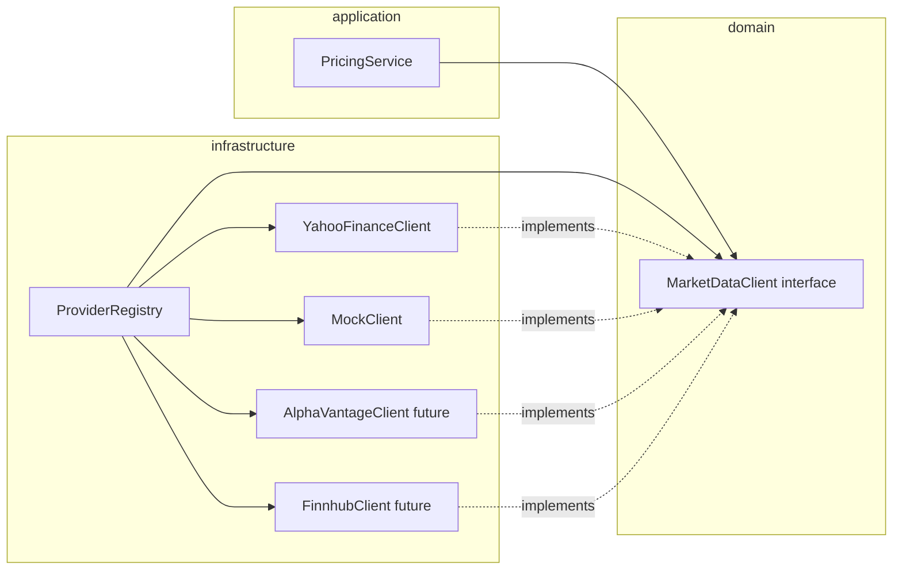

# Plan: US-6.1 Market Data Abstraction Layer

## Pre-requisitos de rama y PR

- **Antes de codear**: Asegurarse de que la rama `develop` esté actualizada (`git checkout develop && git pull origin develop`). Si lo está, crear una nueva rama feature que cubra la US en la que se trabajará (p. ej. `feature/us-6.1-market-data-abstraction` o `feature/market-data-abstraction`), siguiendo la convención de [git-workflow.mdc](.cursor/rules/git-workflow.mdc).
- **Al finalizar el plan**: Abrir el Pull Request con el MCP de GitHub (feature → develop), con descripción clara y checklist de pre-PR cumplido.

## Prioridad y deuda técnica

- **Priorizar el registry completo** (T-6.1.2) para tener la abstracción y el fallback funcionando.
- **No dejar de lado los tests**: incluir tests desde el inicio para no acumular deuda técnica (unit tests del registry, del PricingService con interfaz, y mock client).
- **Usar mock client por ahora**: En lugar de Alpha Vantage/Finnhub reales, usar un cliente mock que implemente `MarketDataClient` (responde OK o falla según símbolo) para validar registry y fallback sin depender de APIs externas.

---

## Contexto actual

- **Pricing actual**: [pricing_service.go](backend/internal/application/services/pricing_service.go) usa directamente `*marketdata.YahooFinanceClient` y `marketdata.Quote`. La caché (`TTLCache`) y la lógica de precios están en la aplicación.
- **Quote existente**: Definido en [yahoo_finance_client.go](backend/internal/infrastructure/marketdata/yahoo_finance_client.go) (Price, Change, ChangePercent, Symbol, MarketState, Currency, UpdatedAt). Debe seguir siendo el DTO canónico para no romper `UpdateAssetPrices` y `PriceHistory.Source`.
- **Config**: [config.go](backend/internal/infrastructure/config/config.go) tiene `PricingConfig` (solo `UpdateIntervalSeconds`). [.env.example](backend/.env.example) menciona `YAHOO_FINANCE_API_KEY` pero el cliente actual no lo usa (Yahoo público).
- **Wire-up**: [server.go](backend/internal/infrastructure/server/server.go) instancia `YahooFinanceClient` y `PricingService` en `runPriceUpdateLoop()`.

Objetivo: introducir una interfaz de dominio, un registro con fallback y configuración por proveedor **sin** cambiar el comportamiento actual hasta que se implementen Alpha Vantage y Finnhub en US-6.2.

---

## Arquitectura objetivo

---

## T-6.1.1: Definir interfaz MarketDataClient

**Ubicación**: Crear `backend/internal/domain/services/market_data_client.go` (nuevo paquete `services` bajo `domain`).

**Contrato**: GetQuote, GetQuotes, GetHistoricalPrices, SupportsSymbol, Name. Tipos `Quote` y `PricePoint` en domain (opción A del plan original) para no depender de infrastructure.

---

## T-6.1.2: Implementar registry y fallback

**Ubicación**: `backend/internal/infrastructure/marketdata/registry.go`. Registry implementa `MarketDataClient`, mantiene por categoría una lista de clientes, aplica fallback y usa **mock client** además de Yahoo para pruebas. Adaptar YahooFinanceClient a la interfaz (devolver `*services.Quote`). PricingService depende de `MarketDataClient` y usa `client.Name()` para Source.

---

## T-6.1.3: Configuración para API keys

**Ubicación**: [config.go](backend/internal/infrastructure/config/config.go) y [.env.example](backend/.env.example). Añadir `MarketDataConfig` (por proveedor: APIKey, Enabled). Carga desde env; en startup solo registrar proveedores habilitados. Por ahora solo Yahoo (y mock en tests).

---

## Orden de implementación sugerido

1. **Rama**: `git checkout develop && git pull origin develop` → `git checkout -b feature/us-6.1-market-data-abstraction`.
2. **T-6.1.1**: Crear `domain/services/market_data_client.go` (interfaz + Quote + PricePoint).
3. **T-6.1.3**: Añadir `MarketDataConfig` y carga en config + `.env.example`.
4. **T-6.1.2**: Registry + adapter Yahoo + **mock client**; actualizar PricingService y server. Incluir **unit tests** (registry con mocks, PricingService con MarketDataClient mock) para no dejar deuda técnica.
5. **PR**: Al finalizar, abrir PR con MCP de GitHub (feature → develop).

---

## Resumen de archivos

| Acción | Archivo |
|--------|--------|
| Crear | `internal/domain/services/market_data_client.go` |
| Crear | `internal/infrastructure/marketdata/registry.go` |
| Crear | `internal/infrastructure/marketdata/mock_client.go` (mock que implementa MarketDataClient) |
| Modificar | `internal/infrastructure/marketdata/yahoo_finance_client.go` |
| Modificar | `internal/infrastructure/config/config.go` |
| Modificar | `internal/application/services/pricing_service.go` |
| Modificar | `internal/infrastructure/server/server.go` |
| Modificar | `.env.example` |
| Crear | Tests: registry_test.go, pricing_service_test.go con mock client |
